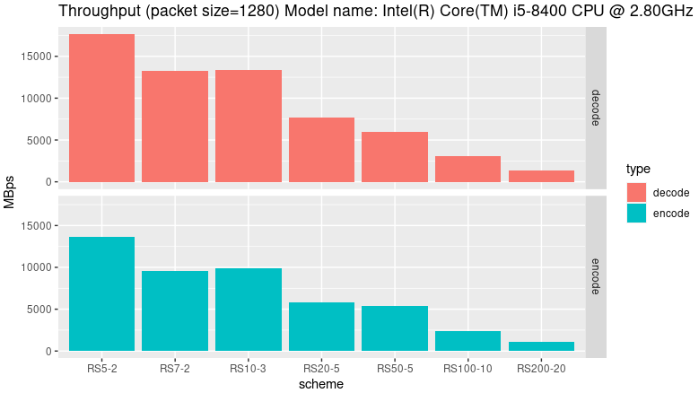

# nanors 

nanors is a tiny, performant implementation of reed solomon codes capable of reaching multi-gigabit speeds on a single core.

It was designed to be compatible with the reed solomon scheme used in NVIDIA GameStream and as such the generator uses a cauchy matrix instead of the more common vandermonde matrix.

## Performance

Good performance is dependent on CPU acceleration, to this end a stripped down and amalgamated version of https://github.com/sleepybishop/oblas is included.

## Benchmark

## Use Cases

 - Applications with small data volumes and low latency requirements.
 - Storage applications, particularly if using a large block size.

## Other Implementations

Most implementations use a standard textbook inversion strategy during decoding, whereas nanors exploits the structure of the matrix to perform the minimum number of operations, as such performance should compare favorably to other implementations on a per core basis.

 - [minio](https://github.com/klauspost/reedsolomon)
 - [backblaze](https://github.com/Backblaze/JavaReedSolomon)
 - [libstorj](https://github.com/storj/libstorj)

