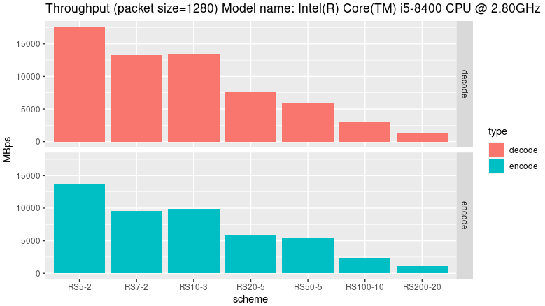

# nanors 

nanors is a tiny, performant implementation of reed solomon codes capable of reaching multi-gigabit speeds on a single core.

## Codecs & Academic References

The library supports two distinct types of Reed-Solomon erasure coding implementations:

  - Cauchy Reed-Solomon [^1] (`rs.c`, `rs16.c`)
  - Additive FFT Reed-Solomon [^2] [^3] (`rs16_afft.c`)

## Performance

Good performance is dependent on CPU acceleration, to this end native architecture is auto detected at runtime and an appropriate backend is used for the heavy math.

## Benchmark

## Use Cases

 - Applications with small data volumes and low latency requirements.
 - Storage applications, particularly if using a large block size.

## Footnotes

[^1]: J. Blömer, M. Kalfane, R. Karp, M. Karpinski, M. Luby, and D. Zuckerman. "An XOR-based erasure-resilient coding scheme." ICSI Technical Report TR-95-048, 1995.
[^2]: Shuhong Gao and Todd Mateer. "Additive Fast Fourier Transforms over Finite Fields." *IEEE Transactions on Information Theory*, 56(12):6265–6272, 2010.
[^3]: Sian-Jheng Lin, Tareq Y. Al-Naffouri, Yunghsiang S. Han, and Wei-Ho Chung. "Novel Polynomial Basis with Fast Fourier Transform and Its Application to Reed–Solomon Erasure Codes." *IEEE Transactions on Information Theory*, 62(11):6284–6299, 2016.
